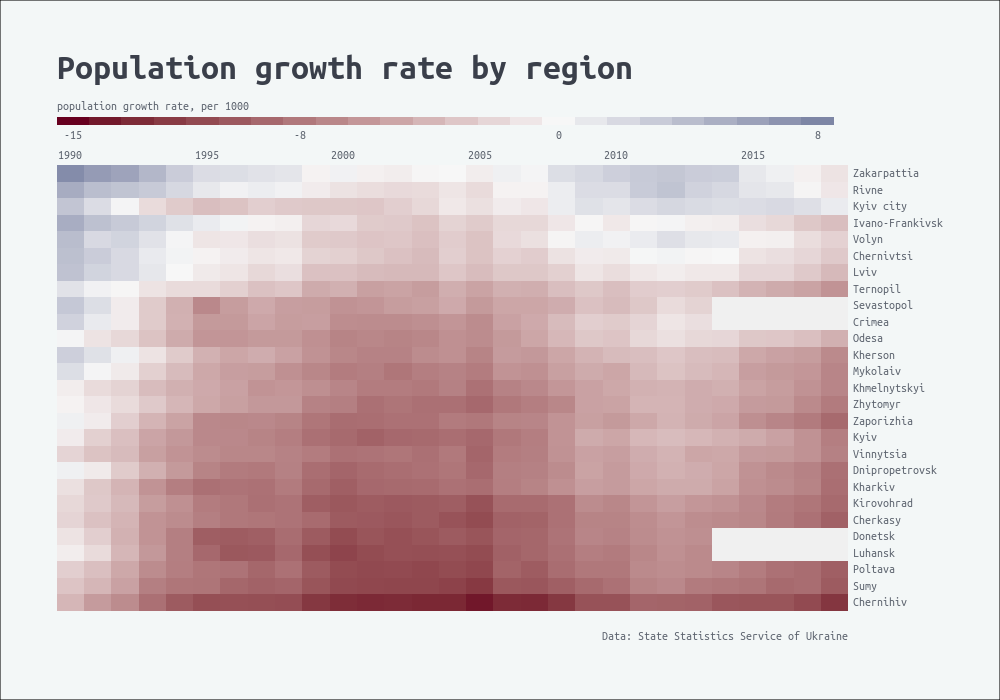

# Assignment 1

## Task
Reproduce data visualization as close to the original as you can.
You can use whatever tool you want.
Important: I don't have to run your homework locally. You can submit:
- Repo with your code and image
- Notebook (Colab, RPubs, Observable, Codepen etc.)

--

### Styles used:
```
Background - #F3F7F7  
Title - #3A3F4A, 36px  
Caption - #5D646F, 12px  
Axis text - #5D646F, 12 px  
Legend title & text - #5D646F, 12 px  
Font Family - Ubuntu Mono  
Color scale #67001f, #f7f7f7, #053061  
```

## Reference image


## Reproduced image

