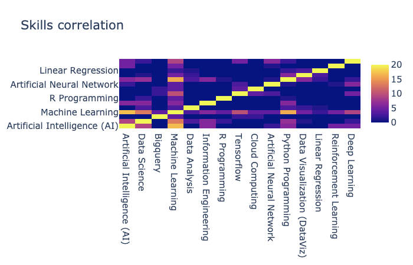

# Introduction to Data Science report

by **Alexander Onbysh**

## Data sources

### Kaggle

[2018 Kaggle ML & DS Survey](https://www.kaggle.com/kaggle/kaggle-survey-2018)

Dataset: 23,859 usable respondents from 147 countries and territories.

Multiple Choice Response dataset consists of 395 columns. Each column is a separate multi-choice question. 

### GlassDoor companies

[Glassdoor Job Search | Find the job that fits your life](https://www.glassdoor.com/index.htm)

Glassdoor is a website where current and former employees anonymously review companies. Glassdoor also allows users to anonymously submit and view salaries as well as search and apply for jobs on its platform.

### Coursera skills

[Coursera | Online Courses & Credentials by Top Educators. Join for Free](https://www.coursera.org/)

500 parsed courses on Machine learning, Data science and Software Engineering along with titles, skills, and courses' descriptions.

## Pre Analysis

 **based on data from Kaggle survey and Glassdoor dataset*

### Degrees

In the plot below, the majority of degrees held by respondents is a Master's degree followed by a Bacholor's and Doctoral degree. The plot shows that majority of DS and ML community have related education in the field.

The most common occupation is Student followed by Data Scientist, Software Engineer and Data Analyst.

### Jobs

There is a significant percentage of those who work in Academics/Education. This can be expected considering the fact that Kaggle is a popular educational resource and that many teachers, professors, research assistants and research scientists.

### Industries

As can be seen, Data Scientists make more money than Data Analysists. The distinction between these two jobs might be subtle but the difference has a significant impact on their income. From this information we could correct Intro to DS and MS in DS programs.

### Yearly income

### Responsibilities & Requirements

From plots we could conclude that  on a par with hard-skills employers trying to find employee with good soft-skills.

Skills like teamwork, critical thinking, self development and business understanding are in great demand. We must take this into account during composition of MS in DS program.

### Programming languages

Programming languages are an important aspect of working in data science. The bar chart is shown below and indicates that majority use Python the most, followed by R and a host of others.

Another questions is what core ML frameworks is necessary for successful ML/DS career. Here the the most popular ML frameworks based on responses. 

### ML frameworks

But how many frameworks is enough? The next plow shows that number of learned frameworks growths with years of experience. But the median stays the same. So, 1-3 frameworks is totally enough for successful ML career.

### Conclusions

- Almost all researchers have a degree in DS field
- Quoter of ML researchers are working in Computers/Technologies field
- Students one of the biggest group in research community
- Salary depends of Job, on average Data scientists are paid more that Data analysts
- Soft-skills is critical for well-paid positions
- Scikit-learn, Tensorflow, Keras and Pytorch the most popular ML frameworks
- 2-3 frameworks is enough for a well-paid position

## Intro to DS course curriculum design

### Skills

Based on previous research we have selected filed and courses that are most relevant for ML and DS positions. We have filtered courses by complexity and have selected only Beginner and Intermediate levels. Based on this data we collected the most common skills that are tough from those courses.

As we can see Programming languages along with programming skills are really necessary for intro learners.

### Skills correlation

On this plot we could see correlation between skills, based on this information we could cluster skills in meaningful subjects for Intro to DS course.

### Grouped skills

So, this is clustered skills.

### 📒Curriculum

Curriculum for Intro to DS splits into **4 major areas**:

1. Intro to AI, Data science and Machine learning
    1. Languages for ML
    2. Linear regression
2. Data visualisation
    1. how to visualise different data
    2. libraries for data visualization
3. ML tooling
    1. Cloud computing
    2. difference between ML frameworks (sk-learn, Tensorflow, OpenCV, Pytorch)
4. State of the art techniques in ML
    1. Neural networks
    2. Deep Learning
    3. Reinforcement learning 

## Data Science program curriculum design

Taking into account all previous research we could compose and cluster skills that are needed for successful ML career. We should take into account that soft-skills should play an important role in educational process.

### Skills

### Skills correlation

### Grouped skills

### 📒Curriculum

**I TERM**

- Programming course (Python, R)
- Statistics
- Teamwork and communication
- <Elective>

**II TERM**

- Introduction to AI and ML
- Cloud computing
- Data Visualisation
- Startup and innovations

**III TERM**

- DB and Big data processing
- Technical writing
- <Elective>
- <Elective>

**Elective courses**

- NLP
- Reinforcement learning
- Computer vision
- ML Framework development
- Management
- Advanced software engineering

**IV TERM**

- Theses work
